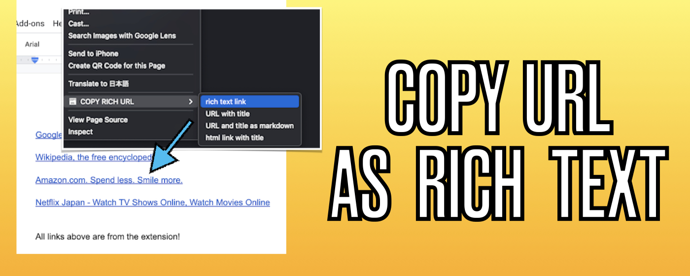
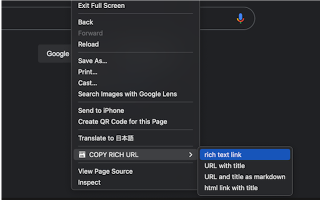
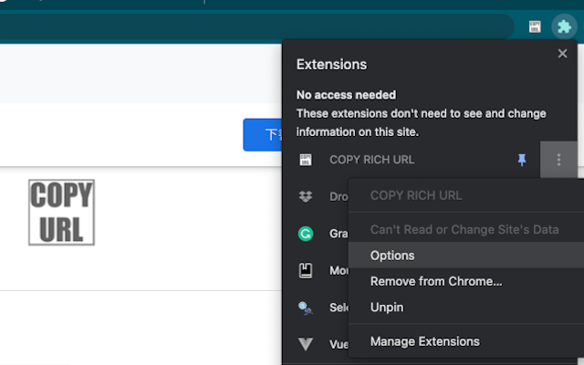
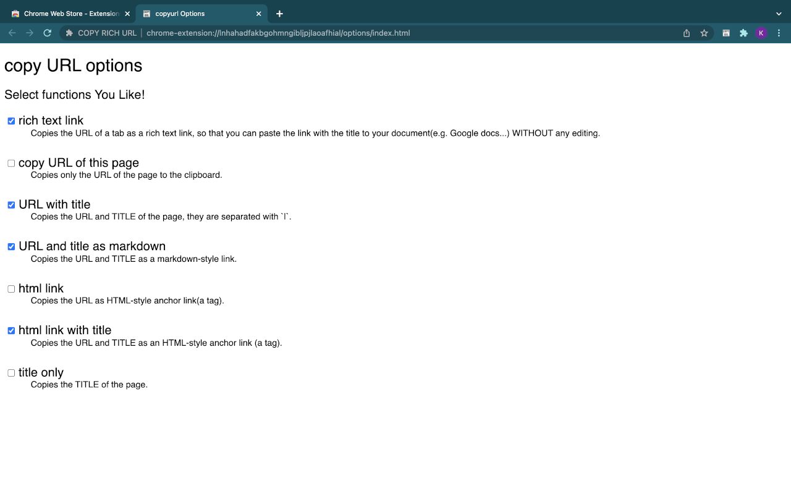
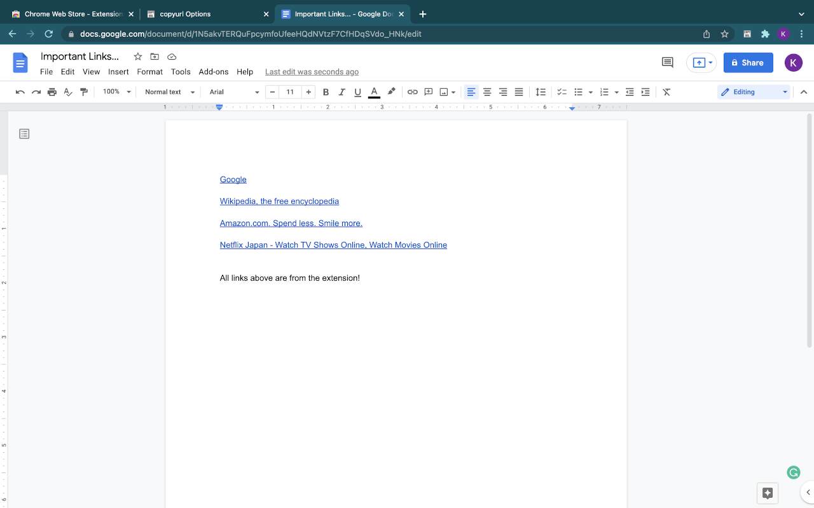

# Copy Rich URL

Chrome extension that lets you copy the current page URL (and title) in multiple formats with **one click** or from the right-click context menu.

[Chrome Web Store → Copy Rich URL](https://chromewebstore.google.com/detail/lijjekihhdocbcginjcbipabahcjpjoe)



---

## Features

| Action | Copied format | Example |
| --- | --- | --- |
| **Rich text link** (default) | Rich-text hyperlink | _Google_ → <https://google.com> |
| **URL only** | `https://example.com` | <https://example.com> |
| **URL + title (text)** | `Example Site | https://example.com` | Example Site \| https://example.com |
| **Markdown link** | `[Example Site](https://example.com)` | `[Example Site](https://example.com)` |
| **HTML link** | `<a href="https://example.com">https://example.com</a>` | `<a href="https://example.com">https://example.com</a>` |
| **HTML link + title** | `<a href="https://example.com">Example Site</a>` | `<a href="https://example.com">Example Site</a>` |
| **Title only** | `Example Site` | Example Site |

Enable/disable each item from the **Options** page.

---

## Demo & Screenshots

| Feature | Preview |
|---------|---------|
| **One-click copy** from toolbar |  |
| **Context menu** (Right-click) options |  |
| **Options page** to enable/disable formats |   |
| **Rich text** pasted into Google Docs |  |

---

## Usage

1. **One-click** – press the extension icon to copy a rich-text link.
2. **Context menu** – right-click anywhere on a page, open **Copy Rich URL**, and choose the desired format.
3. **Options** – in the extension’s _Details_ page click **Extension options** to turn menu items on/off.

The clipboard write uses `navigator.clipboard.write*` with fallback to `document.execCommand('copy')` for maximum compatibility.

---

## Install / Update locally (development)

```bash
# Clone repository
$ git clone https://github.com/ichihara-3/copyurl.git
$ cd copyurl/src

# Load unpacked extension
# Chrome → Extensions → Developer mode → Load unpacked → select `src` folder
```

### Create distribution zip

```bash
$ ./zip_artifacts.sh
# → copyurl_<version>.zip generated in project root
```

---

## Project structure (major files)

```
src/
├─ manifest.json           # Chrome manifest v3
├─ background.js           # service-worker, context-menu handling
├─ modules/background/
│  ├─ Copy.js              # clipboard logic & format converters
│  └─ menus.js             # default menu definitions
├─ options/                # options page (HTML/CSS/JS)
└─ _locales/{en,ja}/       # i18n messages
zip_artifacts.sh           # helper to build release zip
```

---

## Contributing

Pull requests and translations are welcome!  Please open an issue first to discuss substantial changes.

---

## License

[MIT License](LICENSE)
